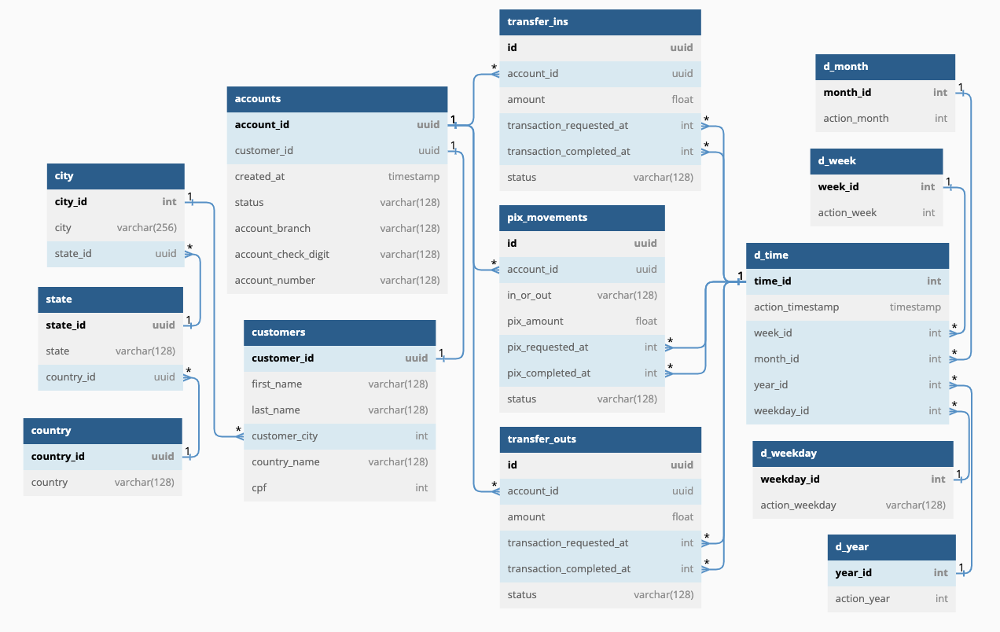

# Projeto Big Data:
---
# Desenvolvimento e Avaliação de uma Arquitetura Distribuída para um Relatório de Saldo Mensal da Conta

## Objetivo

O objetivo deste trabalho é explorar as capacidades de arquiteturas de bancos de dados distribuídos para lidar com conjuntos de dados complexos, em particular, o "Relatório de Saldo Mensal da Conta".

## Base de Dados utilizada

O diagrama das tabelas do banco de dados utilizado no projeto é mostrado a seguir:

As tabelas de dimensões de tempo incluem:
- d_time
- d_year
- d_month
- d_week
- d_weekday

Para as localizações, temos:
- city
- state
- country

Além disso, há tabelas para dados de contas (accounts) e clientes (customers). Três tabelas são usadas para armazenar movimentos financeiros das contas:
- transfer_ins: transferências não PIX recebidas por uma conta (entrada de dinheiro)
- transfer_outs: transferências não PIX feitas por uma conta (saída de dinheiro)
- pix_movements: transferências recebidas ou enviadas de uma conta usando PIX
