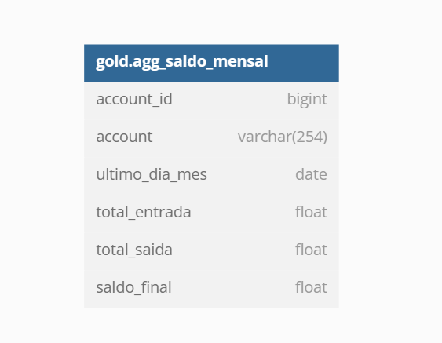

# Projeto Big Data:
---
# Desenvolvimento e Avaliação de uma Arquitetura Distribuída para um Relatório de Saldo Mensal da Conta

## Objetivo

O objetivo deste trabalho é explorar as capacidades de arquiteturas de bancos de dados distribuídos para lidar com conjuntos de dados complexos, em particular, o "Relatório de Saldo Mensal da Conta", que apresenta todos os Saldos Mensais das Contas dos clientes entre Jan/2020 e Dez/2020. Esse projeto propõe uma arquitetura que possibilita o gerenciamento eficiente desses dados, permitindo consultas e análises rápidas, mesmo diante do tamanho considerável da base de dados.

## Base de Dados utilizada

O diagrama das tabelas do banco de dados utilizado no projeto é mostrado a seguir:

As tabelas de dimensões de tempo incluem:
- d_time
- d_year
- d_month
- d_week
- d_weekday

Para as localizações, temos:
- city
- state
- country

Além disso, há tabelas para dados de contas (accounts) e clientes (customers). Três tabelas são usadas para armazenar movimentos financeiros das contas:
- transfer_ins: transferências não PIX recebidas por uma conta (entrada de dinheiro)
- transfer_outs: transferências não PIX feitas por uma conta (saída de dinheiro)
- pix_movements: transferências recebidas ou enviadas de uma conta usando PIX

## Arquitetura Medallion no Databricks Community

A estratégia adotada consiste em organizar os dados em uma arquitetura medallion, utilizando o DBFS do Databricks Community como um data lakehouse. A arquitetura medallion é um padrão de design de dados que organiza logicamente os dados em um lakehouse através das camadas Bronze, Silver e Gold. O objetivo dessa arquitetura é aprimorar incrementalmente a estrutura e a qualidade dos dados à medida que avançam em cada estágio.

A arquitetura desde projeto é apresentada a seguir:

### Camadas:

- **Landing Zone**: Armazena os dados brutos do projeto no formato CSV. A descrição detalhada desses dados pode ser encontrada na seção [Base de dados](#base-de-dados-utilizada).

- **Bronze**: Mantém os dados brutos em formato Parquet, além de criar a estrutura desses dados usando as classes *StructType* e *StructField*. As definições de estrutura são armazenadas em arquivos JSON, salvos no *script* [json_strings.py](./modules/json_strings.py) na pasta [modules](./modules).

- **Silver**: Armazena os dados refinados em tabelas conforme a modelagem a seguir.

A camada Silver também passa por uma etapa de Data Quality, na qual algumas validações são realizadas utilizando Great Expectations (*script* [data-quality.py](./modules/data-quality.py)):

    - Verificação de tipo;
    - Verificação de colunas categóricas;
    - Verificação de colunas ID;
    - Verificação de colunas não vazias;
    - Verificação de valores MIN e MAX.

- **Gold**: Nesta camada, é gerada a tabela com o Saldo Mensal da Conta.

> Os diagramas apresentados podem ser gerados no [dbdiagram.io](https://dbdiagram.io/home) usando o arquivo [tables_diagram_silver_gold.txt](./tables_diagram_silver_gold.txt).